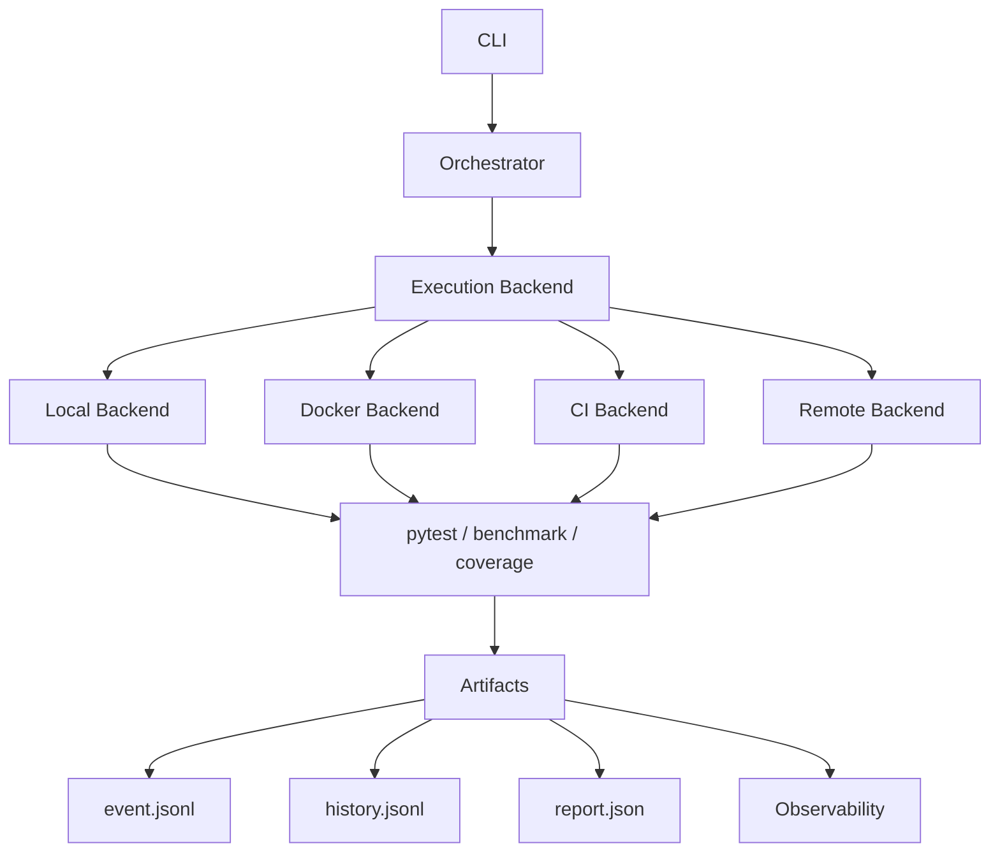

# 🚀 LeetCode Runner

> From LeetCode Testing Tool to Test Orchestration Platform

---

# 🇹🇼 中文版

## 專案介紹

LeetCode Runner 是一個以 Python 開發的 Test Orchestration Framework。

專案最初只是為了執行 LeetCode 題目的 pytest 測試而建立，但隨著架構演進，逐漸發展成一個專注於：

* Test Orchestration
* Execution Platform
* Observability
* Artifact Management
* Extensible Backend Architecture

的 Side Project。

這個專案的核心目標已不再只是刷題，而是透過測試執行流程，探索：

* Framework Design
* Test Infrastructure
* Execution Abstraction
* Platform Engineering
* SDET Engineering Practices

---

## 核心理念

LeetCode Runner 將：

* CLI
* Test Execution
* Benchmark
* Coverage
* Artifact Collection
* Reporting

整合成統一的執行流程。

透過可替換的 Backend 設計，使同一套流程可以在：

* Local Environment
* Docker Container
* CI/CD Pipeline
* Remote Environment

中執行。

---

## Architecture Overview



---

## 專案演進

| Version | Focus                     |
| ------- | ------------------------- |
| v1      | Script Runner             |
| v2      | Layered Architecture      |
| v3      | Execution Backend         |
| v3.1    | Result Model              |
| v3.2    | Execution Platform        |
| v3.3    | Multi Repository Support  |
| v3.4    | Test Infrastructure       |
| v4.0    | Artifact Management       |
| v4.1    | Event Logging             |
| v4.2    | Reporting Pipeline        |
| v4.3    | Observability             |
| v4.4    | Artifact Lifecycle        |
| v4.5    | Schema Evolution          |
| v4.6    | Migration & Compatibility |

---

## Current Focus (v4.6)

### Orchestration

Runner 負責：

* Workflow Coordination
* Tool Integration
* Artifact Collection
* Result Aggregation

而不直接關心實際執行細節。

---

### Execution Platform

Execution Layer 可以透過不同 Backend 進行替換：

* Local Backend
* Docker Backend
* CI Backend
* Remote Backend

---

### Observability

Execution 過程中產生：

* Event Logs
* Execution History
* Reports

以支援：

* Debugging
* Auditing
* Analysis

---

### Artifact Management

Runner 產生統一格式的 Artifact：

```text
artifacts/
├── event.jsonl
├── history.jsonl
└── report.json
```

用於：

* Execution Replay
* Reporting
* Trend Analysis
* Future Platform Integration

---

### Schema Evolution

當 Artifact Format 發生變更時：

需要考慮：

* Backward Compatibility
* Migration Strategy
* Schema Versioning

這也是大型平台系統常見的問題。

---

## What I Learned

透過這個專案，我逐漸理解：

* Execution 是 Architecture Decision
* Observability 不只是 Logging
* Artifact 本身也是產品的一部分
* Infrastructure 問題比想像中更早出現
* Framework Design 比功能實作更困難

---

## Future Roadmap

### v4.x

* Docker Backend
* CI Backend
* Artifact Versioning
* Migration Framework

### v5

* Distributed Execution
* Plugin System
* Event Streaming
* Web Dashboard

### v6

* Multi-Tenant Test Platform
* Kubernetes Integration
* Execution Scheduling
* Platform API

---

# 🇺🇸 English Version

## Overview

LeetCode Runner is a Python-based Test Orchestration Framework.

Originally created to execute pytest test cases for LeetCode solutions, the project gradually evolved into a platform focused on:

* Test Orchestration
* Execution Platforms
* Observability
* Artifact Management
* Extensible Backend Architecture

Rather than being a pure LeetCode utility, it serves as a playground for exploring:

* Framework Design
* Test Infrastructure
* Platform Engineering
* Execution Abstraction
* SDET Practices

---

## Core Concepts

LeetCode Runner unifies:

* CLI
* Test Execution
* Benchmarking
* Coverage Analysis
* Artifact Collection
* Reporting

into a single orchestration workflow.

Execution can be delegated to different backends:

* Local Environment
* Docker Containers
* CI/CD Pipelines
* Remote Environments

---

## Architecture


---

## Evolution

| Version | Focus                     |
| ------- | ------------------------- |
| v1      | Script Runner             |
| v2      | Layered Architecture      |
| v3      | Execution Backend         |
| v3.1    | Result Model              |
| v3.2    | Execution Platform        |
| v3.3    | Multi Repository Support  |
| v3.4    | Test Infrastructure       |
| v4.0    | Artifact Management       |
| v4.1    | Event Logging             |
| v4.2    | Reporting Pipeline        |
| v4.3    | Observability             |
| v4.4    | Artifact Lifecycle        |
| v4.5    | Schema Evolution          |
| v4.6    | Migration & Compatibility |

---

## Current Focus

### Orchestration

The Runner coordinates:

* Workflow Execution
* Tool Integration
* Artifact Collection
* Result Aggregation

while remaining independent from execution details.

---

### Execution Platform

Execution can be delegated to:

* Local Backend
* Docker Backend
* CI Backend
* Remote Backend

---

### Observability

Execution produces:

* Event Logs
* History Records
* Reports

to support:

* Debugging
* Auditing
* Analytics

---

### Artifact Management

Artifacts are stored in standardized formats:

```text
artifacts/
├── event.jsonl
├── history.jsonl
└── report.json
```

for:

* Replay
* Reporting
* Trend Analysis
* Future Platform Integrations

---

### Schema Evolution

As artifact schemas evolve, the framework must address:

* Backward Compatibility
* Migration Strategy
* Versioning

which are common challenges in production-grade platforms.

---

## Key Learnings

This project taught me that:

* Execution is an architectural decision.
* Observability is more than logging.
* Artifacts are part of the product.
* Infrastructure concerns emerge earlier than expected.
* Framework design is harder than feature implementation.

---

## Roadmap

### v4.x

* Docker Backend
* CI Backend
* Artifact Versioning
* Migration Framework

### v5

* Distributed Execution
* Plugin System
* Event Streaming
* Web Dashboard

### v6

* Multi-Tenant Test Platform
* Kubernetes Integration
* Execution Scheduling
* Platform APIs
