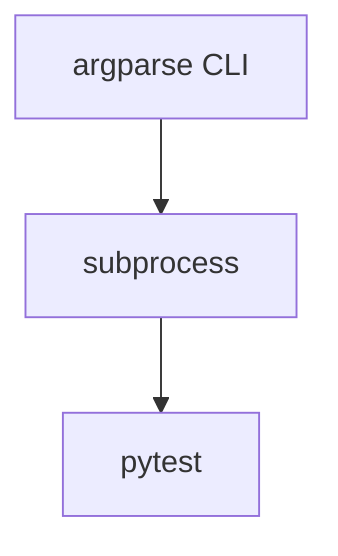

# v1 — Script Runner

---

# 當時的目標

其實很單純。

我只是想要讓 LeetCode 題目可以：

- 自動執行 pytest
- 不用每次手動打 command
- 用 CLI 管理

那時候完全沒有想到什麼架構設計。

比較像是：

> 「先把東西做出來。」

---

# 當時的設計

架構非常簡單。



---

# Sample Code

```python
import argparse
import subprocess

parser = argparse.ArgumentParser()
parser.add_argument("--problem")

args = parser.parse_args()

subprocess.run(["python", "-m", "pytest"])
```

---

# 我當時的想法

老實說。

那時候我覺得：

```python
subprocess.run(...)
```

就只是：

> 「把 command 跑起來。」

而已。

沒有想過這件事情有什麼複雜的。

---

# 遇到的問題

後來開始發現一件奇怪的事情。

有時候：

```bash
pytest
```

可以跑。

有時候卻不行。

甚至：

同樣的 code。

換個 repo 就壞掉。

---

# 我當時的疑問

我一直覺得很奇怪。

為什麼：

```bash
pytest
```

跟：

```bash
python -m pytest
```

結果不一定一樣？

---

# 與 ChatGPT 的討論

ChatGPT 提到：

```text
pytest 依賴 PATH

python -m pytest
依賴目前 interpreter
```

這時候我才第一次意識到：

> 執行環境其實是一個問題。

---

# 後來怎麼理解

以前會覺得：

執行測試 = 執行 command

後來發現：

其實是：

執行測試 =

command
+
runtime
+
dependency
+
environment

---

# 這一版最大的收穫

第一次開始思考：

> Execution Environment Ownership

這個概念。

---

# 下一版為什麼會出現

功能開始變多：

- benchmark
- coverage
- 多 command

argparse 開始變得難維護。

我開始覺得：

> 需要有更清楚的分層。
