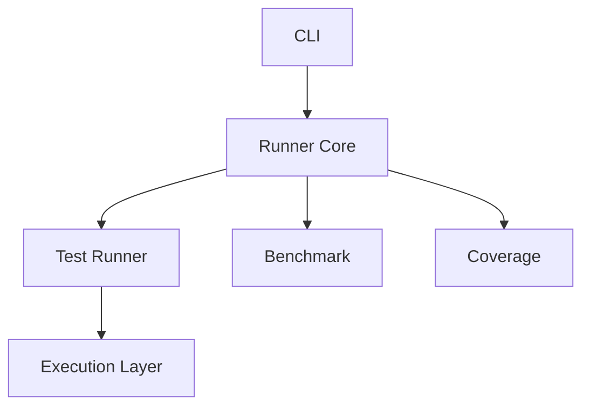

# v2 — Layered Architecture

---

# 當時的目標

讓專案不要再是一個 script。

開始有：

- CLI
- Runner
- Execution Layer

的概念。

---

# 為什麼要重構

隨著功能增加：

- benchmark
- coverage
- report

所有東西都混在一起。

我開始覺得：

> 好像不太對。

---

# 當時的設計



---

# 改用 Typer

```python
import typer

app = typer.Typer()

@app.command()
def run(problem: str):
    print(problem)
```

---

# 我當時最大的疑問

有一天突然想到：

> pytest 本身就已經是 runner 了。

那我現在到底在做什麼？

---

# 與 ChatGPT 的討論

ChatGPT 提到：

```text
pytest = execution engine

LeetCode Runner = orchestration layer
```

這句話對我影響很大。

---

# 當時的感覺

有種突然開竅的感覺。

原來：

我並不是在寫：

> Test Framework

而是在寫：

> Framework 上層的 Runner

---

# 遇到的問題

雖然開始分層。

但 execution 還是寫死。

```python
subprocess.run(...)
```

到處都是。

---

# 我當時的疑問

如果未來我要：

- Docker
- GitHub Actions
- Remote Execution

怎麼辦？

是不是每個地方都要改？

---

# 後來怎麼理解

我第一次開始感受到：

> code 能 work

跟：

> design 能 evolve

是兩件不同的事。

---

# 這一版最大的收穫

理解：

> Orchestration Layer

的概念。

---

# 下一版為什麼會出現

我開始意識到：

Execution 本身應該可以被替換。

而不是固定綁死 subprocess。
