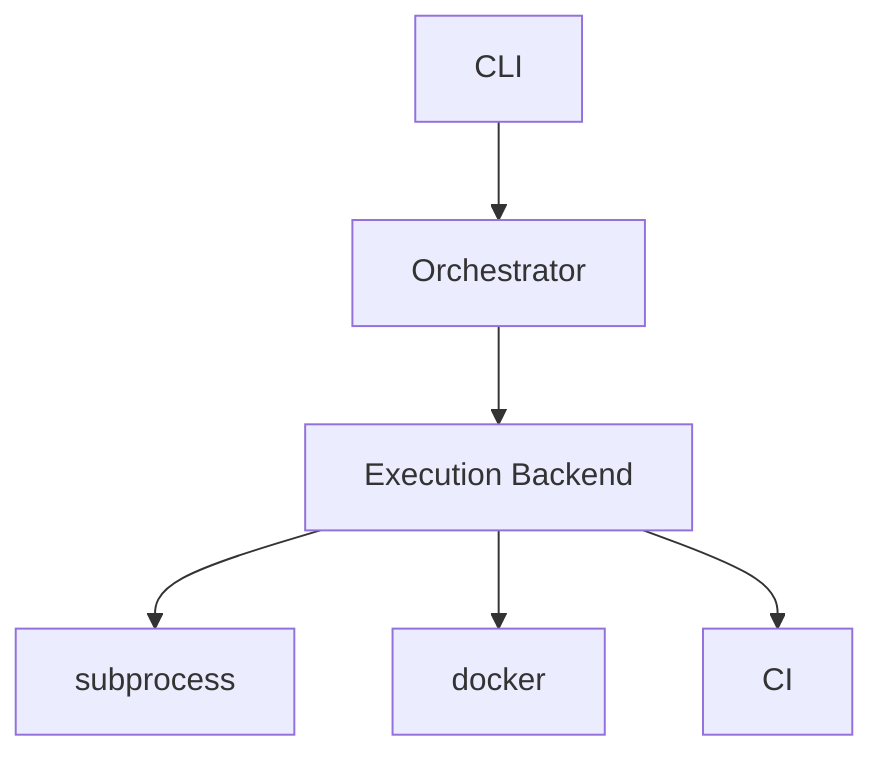

# v3 — Execution Backend

---

# 當時的目標

把 Execution 抽象化。

---

# 為什麼會有這一版

我開始一直思考：

如果：

- subprocess
- docker
- ci

都能執行測試。

那它們是不是其實只是不同的 implementation？

---

# 當時的設計



---

# Interface

```python
from abc import ABC, abstractmethod

class ExecutionBackend(ABC):

    @abstractmethod
    def run(self, command: str):
        pass
```

---

# Orchestrator

```python
class Orchestrator:

    def __init__(self, backend):
        self.backend = backend

    def run_tests(self):
        return self.backend.run("python -m pytest")
```

---

# 我當時最大的疑問

Execution 到底是：

implementation

還是：

abstraction？

---

# 與 ChatGPT 的討論

ChatGPT 提到：

> 這其實就是 Strategy Pattern。

那時候我突然覺得：

Design Pattern 不再只是書上的東西。

---

# 當時的感受

以前看 Strategy Pattern：

總覺得很抽象。

但這次是問題先出現。

Pattern 自己長出來。

---

# 後來怎麼理解

Execution 不是：

```python
subprocess.run(...)
```

而已。

Execution 其實是一個：

Architecture Decision。

---

# 這一版最大的收穫

第一次真正理解：

- abstraction
- backend
- strategy

在真實專案裡的用途。

---

# 如果重來一次

我可能會更早：

把 execution 抽出來。

而不是等功能越來越多才重構。

---

# 下一版為什麼會出現

Execution 雖然抽出來了。

但：

- logging
- error handling
- observability

開始變成新的問題。

於是出現：

v3.1 Result Model
