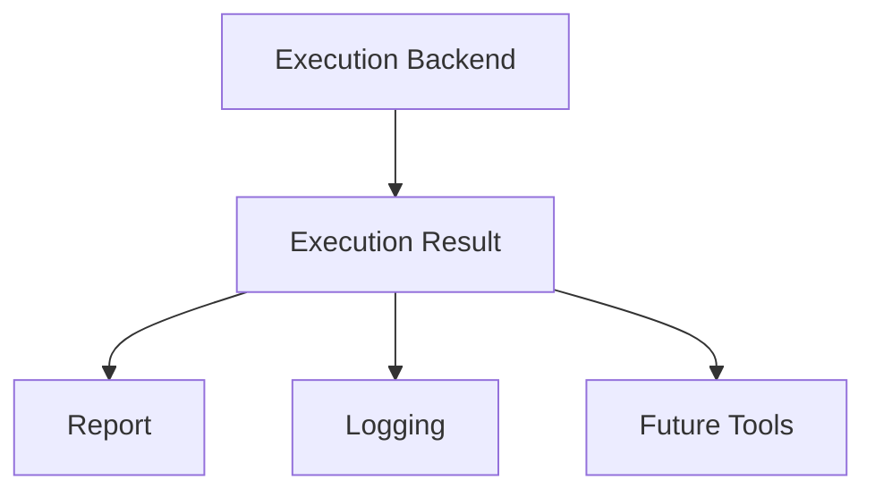

# v3.1 — Result Model & Observability

---

# 當時的目標

讓 Execution 的結果有一致的格式。

---

# 為什麼會有這一版

v3 已經完成：

- Execution Backend
- Orchestrator
- Backend Abstraction

但開始遇到新的問題。

不同 Backend 回傳的結果格式不一致。

例如：

subprocess：

```python
CompletedProcess(...)
```

未來如果是：

- Docker Backend
- CI Backend
- Remote Backend

結果可能完全不同。

---

# 我當時的疑問

Execution Backend 已經抽象化了。

但：

結果呢？

是不是也應該抽象化？

---

# 與 ChatGPT 的討論

ChatGPT 提醒我：

真正成熟的 Framework：

不只抽象化 Interface。

還會抽象化：

- Data Model
- Result Model

---

# 當時的設計



---

# Sample Code

```python
from dataclasses import dataclass

@dataclass
class ExecutionResult:
    return_code: int
    stdout: str
    stderr: str
```

---

# 我後來怎麼理解

以前覺得：

```python
subprocess.run(...)
```

回傳什麼就用什麼。

後來發現：

這會讓 Framework 綁死在 implementation。

---

# 最大收穫

開始理解：

> abstraction 不只是 Interface。

還包含：

- Input Model
- Output Model
- Event Model

---

# 如果重來一次

我會更早建立：

ExecutionResult

而不是直接使用 subprocess 的回傳物件。

---

# 下一版為什麼出現

我開始思考：

Backend 不只是執行 command。

Execution Environment 本身也是問題。

於是開始出現：

Execution Platform 的概念。
