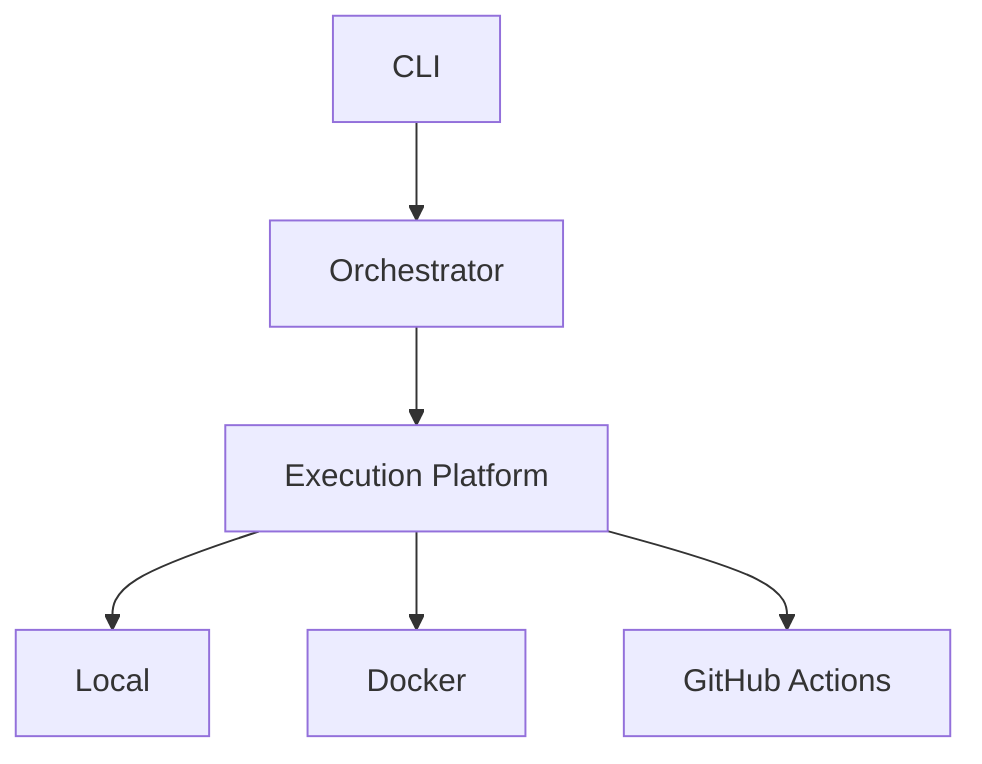

# v3.2 — Execution Platform

---

# 當時的目標

解決：

Execution Environment Ownership Problem

---

# 為什麼會有這一版

v1 時期其實就碰到：

```bash
pytest
```

與：

```bash
python -m pytest
```

的差異。

但當時還沒真正理解。

---

到了 v3.2。

這個問題再次浮現。

而且變得更嚴重。

因為開始思考：

- Docker
- CI
- Multi Repo

---

# 我當時的疑問

如果：

同樣的 command

在：

- local
- docker
- github actions

執行

結果不同怎麼辦？

---

# 與 ChatGPT 的討論

ChatGPT 提到：

這已經不是：

Command Problem

而是：

Execution Platform Problem

---

# 當時的設計



---

# 我後來怎麼理解

以前會覺得：

Backend = Process Wrapper

後來開始覺得：

Backend = Execution Platform

---

# 最大收穫

第一次開始理解：

Infrastructure 問題。

---

# 當時的感受

我其實有點驚訝。

因為：

原本只是想做 LeetCode Runner。

結果開始思考：

- runtime
- environment
- platform

這些東西。

---

# 如果重來一次

我會更早：

把 execution environment 視為一級公民（first-class citizen）。

---

# 下一版為什麼出現

開始出現：

不同 Repo
不同 Runtime

的需求。

於是有了：

Execution Context。
