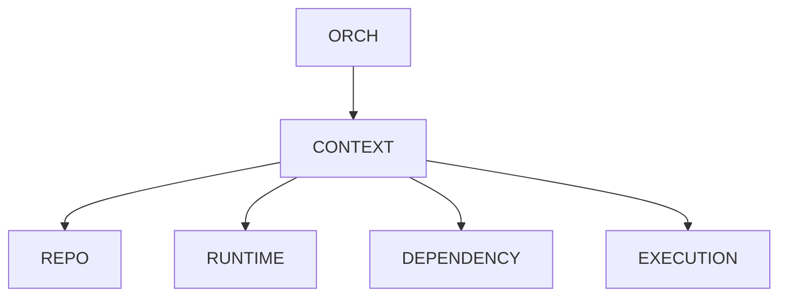

# v3.3 — Multi Repository Support

---

# 當時的目標

支援：

不同 Repository

不同 Runtime

不同 Dependency

---

# 為什麼會有這一版

當我開始思考：

LeetCode Runner

是不是只能跑自己的 repo？

---

如果未來：

- LeetCode
- Side Project
- Open Source Project

都想跑呢？

---

# 我當時的疑問

Execution Backend

真的只需要：

```python
run(command)
```

嗎？

---

還是：

Repository Context

也應該存在？

---

# 與 ChatGPT 的討論

ChatGPT 提到：

很多成熟系統：

其實都有 Context Layer。

例如：

- Request Context
- User Context
- Execution Context

---

# 當時的設計



---

# Sample Code

```python
class ExecutionContext:

    repo_path: str

    runtime: str

    dependencies: list[str]
```

---

# 我後來怎麼理解

Backend 不只是：

Process Abstraction

而是：

Environment Abstraction

---

# 最大收穫

開始理解：

Context Layer

的重要性。

---

# 如果重來一次

我會把：

ExecutionContext

放在更前面設計。

---

# 下一版為什麼出現

開始發現：

Runner 已經不像工具。

越來越像：

Infrastructure Framework。
