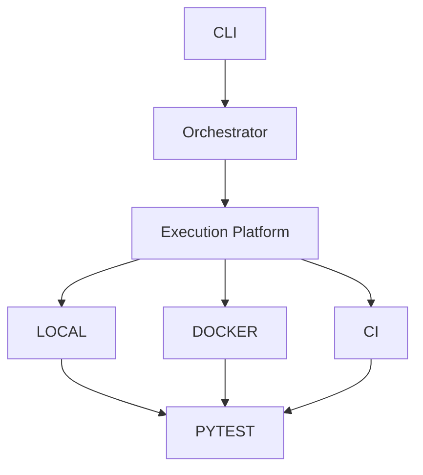

# v3.4 — Toward Test Infrastructure

---

# 當時的目標

重新定義：

LeetCode Runner 是什麼？

---

# 為什麼會有這一版

做到這裡時。

我開始有種奇怪的感覺。

---

原本的目標：

```text
跑 LeetCode
```

好像已經不是重點。

---

真正吸引我的東西變成：

- orchestration
- execution
- backend
- environment
- abstraction

---

# 我當時的疑問

我到底在做：

LeetCode Tool

還是：

Framework？

---

# 與 ChatGPT 的討論

ChatGPT 提到：

你現在碰到的問題：

比較接近：

- Test Infra
- QA Platform
- SRE Tooling

而不是：

LeetCode 本身。

---

# 當時的設計



---

# 我後來怎麼理解

這個專案最大的價值。

已經不是：

LeetCode。

而是：

Framework Design。

---

# 當時最大的感觸

以前我會覺得：

寫 code 是最重要的。

---

後來開始覺得：

真正困難的是：

- abstraction
- boundaries
- extensibility

---

# 最大收穫

第一次覺得：

自己開始用：

Platform Thinking

在思考問題。

---

# 如果重來一次

我可能會更早：

把 Runner

定位成：

Test Orchestration Framework

而不是：

LeetCode Tool

---

# 為什麼會有 v4

因為開始思考：

Execution 完之後呢？

結果去哪？

Report 呢？

History 呢？

Audit 呢？

Replay 呢？

於是開始進入：

Artifact Management

與

Observability

的世界。
