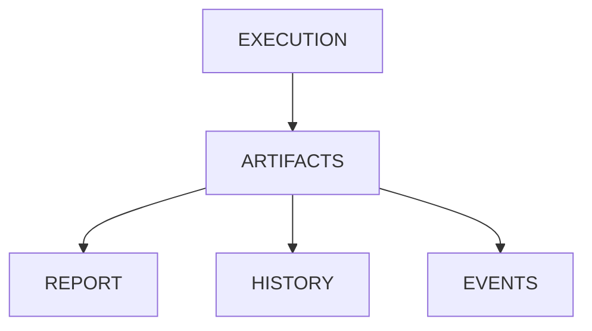

# v4.0 — Artifact Management

---

# 當時的目標

開始管理測試執行後產生的資料。

---

# 為什麼會有這一版

做到 v3.4 時。

Execution 已經可以：

- local
- docker
- CI

執行。

但我突然發現：

執行完之後呢？

結果去哪裡？

---

# 我當時的疑問

以前都是：

```python
result = backend.run(...)
print(result)
```

然後就結束。

---

但如果未來想做：

- Report
- Dashboard
- Trend Analysis

怎麼辦？

---

# 與 ChatGPT 的討論

ChatGPT 提到：

Execution Result

其實也是一種 Artifact。

---

# 當時的設計



---

# 我後來怎麼理解

Execution 是一次性的。

Artifact 是長期存在的。

---

# 最大收穫

開始從：

Run Test

變成：

Manage Test Results

---

# 下一版為什麼出現

開始思考：

Artifact 要如何被記錄？
