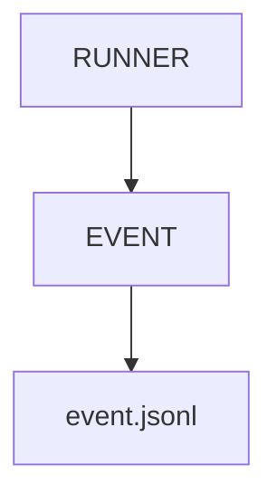

# v4.1 — Event Logging

---

# 當時的目標

建立 Event Log。

---

# 為什麼會有這一版

我開始發現：

Report 只能看結果。

看不到過程。

---

# 我當時的疑問

如果某次測試失敗：

我是怎麼走到那一步的？

---

# 與 ChatGPT 的討論

ChatGPT 提到：

Observability 的第一步：

不是 Dashboard。

而是 Event。

---

# 當時的設計



---

# Event Example

```json
{
  "timestamp": "...",
  "event": "execution_started"
}
```

---

# 我後來怎麼理解

Event Log：

不是 Report。

而是 History。

---

# 最大收穫

第一次開始接觸：

Event Sourcing

的思維。
