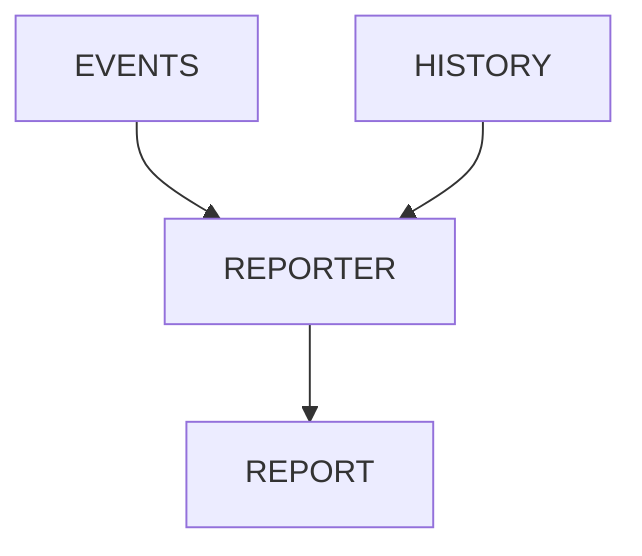

# v4.2 — Reporting Pipeline

---

# 當時的目標

建立統一的報告產生流程。

---

# 為什麼會有這一版

Event 有了。

History 有了。

但使用者還是想看：

結果。

---

# 我當時的疑問

Report 是：

Execution Output

還是：

Artifact Aggregation？

---

# 與 ChatGPT 的討論

ChatGPT 提到：

Report 應該從 Artifact 產生。

而不是直接從 Execution 產生。

---

# 當時的設計



---

# report.json

```json
{
  "total": 100,
  "passed": 98,
  "failed": 2
}
```

---

# 我後來怎麼理解

Report 是 View。

Artifact 才是 Source of Truth。

---

# 最大收穫

開始理解：

Pipeline Thinking。
