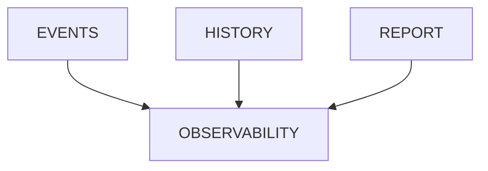

# v4.3 — Observability

---

# 當時的目標

讓 Runner 可被觀察。

---

# 為什麼會有這一版

有了：

- Event
- History
- Report

但還是很難 Debug。

---

# 我當時的疑問

Logging 就是 Observability 嗎？

---

# 與 ChatGPT 的討論

ChatGPT 提到：

Observability >

Logging

---

# 當時的設計

---

# 我後來怎麼理解

Observability 是：

回答未知問題的能力。

---

# 最大收穫

開始理解：

Logs

Metrics

Traces

這些概念。
