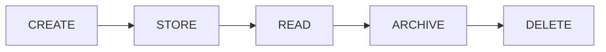

# v4.4 — Artifact Lifecycle

---

# 當時的目標

管理 Artifact 的生命週期。

---

# 為什麼會有這一版

Artifact 越來越多。

開始出現：

- event.jsonl
- history.jsonl
- report.json

---

# 我當時的疑問

Artifact：

什麼時候建立？

什麼時候刪除？

保留多久？

---

# 當時的設計

---

# 我後來怎麼理解

Artifact 不是檔案。

Artifact 是資產。

---

# 最大收穫

開始思考：

Data Lifecycle。
