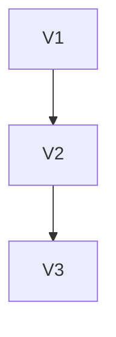

# v4.5 — Schema Evolution

---

# 當時的目標

讓 Artifact Schema 可以演進。

---

# 為什麼會有這一版

有一天突然想到：

如果：

report.json

新增欄位呢？

---

# 我當時的疑問

舊版本怎麼辦？

---

# 與 ChatGPT 的討論

ChatGPT 提到：

Production System

一定會遇到：

Schema Evolution。

---

# 當時的設計



---

# Example

v1

```json
{
  "passed": 10
}
```

v2

```json
{
  "passed": 10,
  "failed": 2
}
```

---

# 我後來怎麼理解

Schema：

不是一次設計完。

而是持續演進。

---

# 最大收穫

開始理解：

Backward Compatibility。
