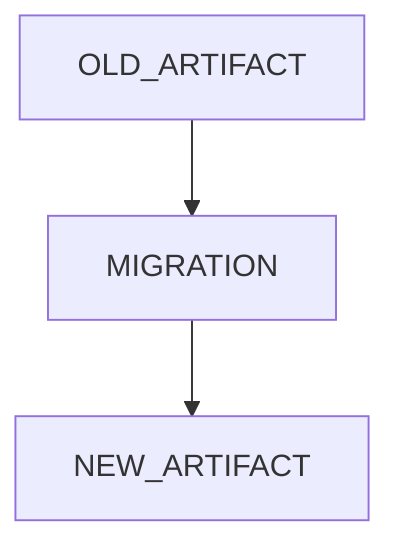

# v4.6 — Migration & Compatibility

---

# 當時的目標

解決 Schema Evolution 帶來的問題。

---

# 為什麼會有這一版

當 Schema 變更後。

開始出現：

舊 Artifact

無法被新系統讀取。

---

# 我當時的疑問

是不是需要：

Migration？

---

# 與 ChatGPT 的討論

ChatGPT 提到：

只要上 Production。

Migration 幾乎無法避免。

---

# 當時的設計



---

# Migration Example

```python
def migrate_v1_to_v2(report):
    report["failed"] = 0
    return report
```

---

# 我後來怎麼理解

Schema Evolution

真正困難的不是：

新增欄位。

而是：

如何不破壞舊資料。

---

# 最大收穫

第一次開始思考：

Compatibility

Migration

Versioning

這些 Production System 才會碰到的問題。

---

# 為什麼會有 v4.7

做到這裡時。

我開始發現：

Runner

不應該直接管理 Artifact。

Orchestrator

應該只負責流程。

Artifact

應該被獨立管理。

於是開始往：

Event Bus

Artifact Store

Observability Pipeline

的方向思考。
