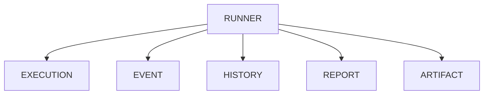
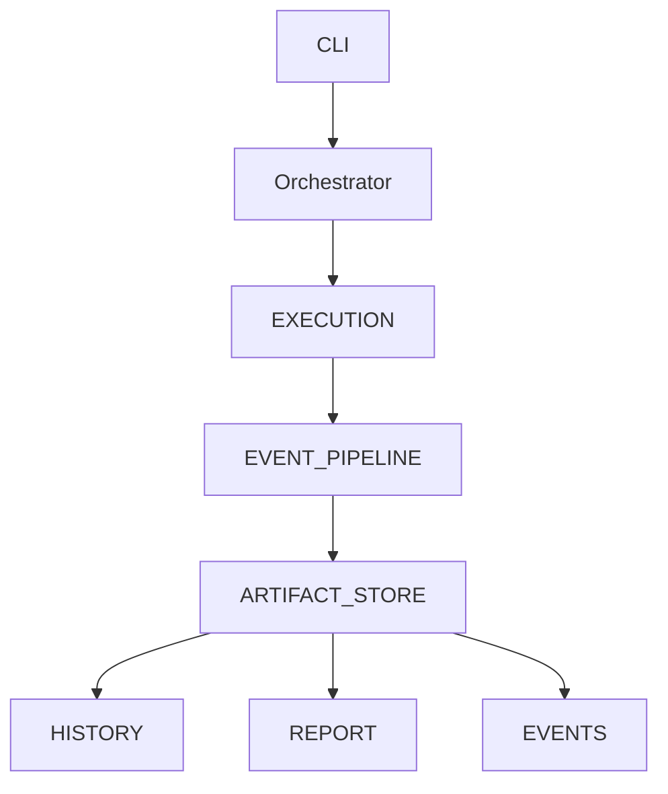

# v4.7 — Artifact Store & Event Pipeline

---

# 當時的目標

讓 Runner 回歸本質。

只負責：

- Workflow Coordination
- Orchestration

而不是管理所有資料。

---

# 為什麼會有這一版

做到 v4.6 時。

Runner 已經負責：

- Execution
- Event Logging
- History Management
- Report Generation
- Artifact Lifecycle
- Migration

開始有一種感覺：

> Runner 好像知道太多事情了。

---

# 我當時的疑問

Runner 應該負責：

```text
執行流程
```

還是：

```text
執行流程
+
資料儲存
+
資料管理
+
資料轉換
```

？

---

# 與 ChatGPT 的討論

ChatGPT 提到：

當一個元件開始同時負責：

- Execution
- Storage
- Reporting

通常代表：

> 責任開始混在一起了。

---

# 當時的觀察

以前的流程大概長這樣：



幾乎所有東西都掛在 Runner 上。

---

# 我開始意識到的問題

如果未來：

- Web Dashboard
- Multiple Reporters
- Analytics
- Event Streaming

出現時。

Runner 還要繼續管理所有東西嗎？

感覺不合理。

---

# 設計調整

我開始重新切分責任。



---

# 新的思考方式

Runner 不再直接產生：

- report.json
- history.jsonl

Runner 只產生：

```text
Event
```

---

# Event Pipeline

```mermaid
graph LR

Execution

--> Event

--> Event Pipeline

--> Artifact Store
```

---

# Sample Code

```python
class EventLogger:

    def publish(self, event):
        pass
```

---

```python
class ArtifactStore:

    def save(self, artifact):
        pass
```

---

```python
class Orchestrator:

    def run(self):

        self.event_logger.publish(
            ExecutionStarted()
        )

        result = self.backend.run()

        self.event_logger.publish(
            ExecutionFinished(result)
        )
```

---

# 我後來怎麼理解

以前的想法：

```text
Runner 執行完
直接寫 report.json
```

---

後來變成：

```text
Runner 發送 Event

Event Pipeline 負責處理

Artifact Store 負責儲存
```

---

# 最大收穫

第一次開始接觸：

Event-Driven Thinking

---

# 當時最大的感觸

以前覺得：

```python
save_report()
```

很正常。

---

後來開始思考：

Report

是不是其實應該是：

Artifact Store 的責任？

而不是 Runner 的責任？

---

# 如果重來一次

我可能會更早：

把 Storage 與 Execution 分離。

---

# 我開始看到的未來方向

做到這裡時。

我開始覺得：

LeetCode Runner 好像正在往：

Test Platform

的方向發展。

因為：

- Event
- Artifact
- History
- Reporting

都開始獨立成模組。

---

# 為什麼會有 v5

做到這裡時。

新的問題出現了。

---

如果：

Execution Backend

不只一個呢？

---

如果：

10 個測試同時執行呢？

---

如果：

Docker Backend

和

CI Backend

同時執行呢？

---

這時候開始思考：

- Parallel Execution
- Scheduling
- Distributed Runner
- Worker Model

於是逐漸進入：

v5 — Distributed Test Orchestration
