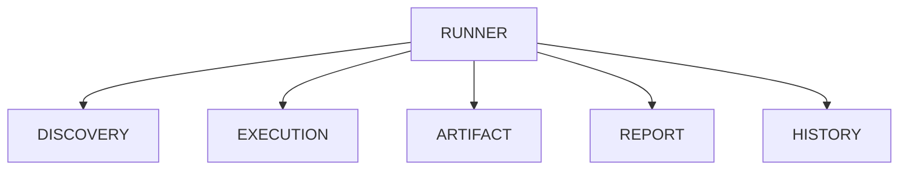
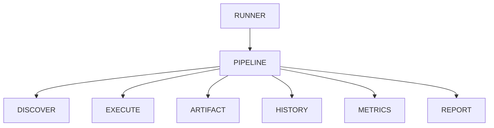

# v4.8 — Workflow Pipeline

---

# 當時的目標

讓 Runner 不再直接執行所有流程。

改由 Workflow Pipeline 統一管理。

---

# 為什麼會有這一版

做到 v4.7 時。

已經有：

- EventLogger
- ArtifactStore
- HistoryStore
- Reporter

開始發現一件事。

---

Runner 本身變得越來越肥。

```text
Runner

負責：

- Discovery
- Execution
- Artifact
- History
- Metrics
- Report
```

---

每增加一個功能。

Runner 就要修改一次。

---

# 我當時的疑問

Runner 真的是：

系統核心嗎？

---

還是：

只是 Workflow 的入口？

---

# 與 ChatGPT 的討論

ChatGPT 提到：

很多成熟系統：

例如：

- Jenkins
- GitHub Actions
- Airflow

都有一個共同點。

---

它們的核心不是：

```python
run()
```

而是：

```text
Workflow
```

---

# 我開始觀察到的問題

以前的流程：



---

所有事情都掛在 Runner 上。

---

導致：

新增功能

↓

修改 Runner

↓

測試 Runner

↓

風險增加

---

# 當時的設計

我開始引入：

Pipeline

與

Stage

概念。

---

# 新架構



---

# Workflow Pipeline

```python
class WorkflowPipeline:

    def __init__(self, stages):
        self.stages = stages

    def run(self, context):

        for stage in self.stages:
            context = stage.run(context)

        return context
```

---

# Stage Interface

```python
from abc import ABC, abstractmethod

class Stage(ABC):

    @abstractmethod
    def run(self, context):
        pass
```

---

# Discovery Stage

```python
class DiscoverStage(Stage):

    def run(self, context):

        tests = discover_tests()

        context.tests = tests

        return context
```

---

# Execute Stage

```python
class ExecuteStage(Stage):

    def run(self, context):

        result = execute_tests(
            context.tests
        )

        context.result = result

        return context
```

---

# 我當時最大的感觸

這次重構和 v3 很像。

---

v3 的時候：

我發現：

Execution

應該被抽象化。

---

v4.8：

我開始發現：

Workflow

也應該被抽象化。

---

# 我後來怎麼理解

以前：

```python
runner.run()
```

做完所有事情。

---

現在：

```python
pipeline.run()
```

負責：

協調流程。

---

每個 Stage：

只負責自己的事情。

---

# 最大收穫

開始理解：

Pipeline Architecture

---

以及：

Separation of Concerns

其實不只發生在：

- Backend

也會發生在：

- Workflow

---

# 如果重來一次

我可能在 v2 就會開始思考：

Workflow Layer

的存在。

---

# 我開始看到的未來方向

做到這裡時。

我突然發現：

LeetCode Runner

開始長得有點像：

- Jenkins Pipeline
- GitHub Actions Workflow
- Airflow DAG

---

只是規模比較小。

---

但核心思想其實很接近。

---

# 為什麼會有 v4.9

Pipeline 有了。

Stage 有了。

---

新的問題出現。

---

Stage 之間：

如何共享資料？

---

Context 應該長什麼樣子？

---

不同 Stage：

如何傳遞狀態？

---

於是開始思考：

Workflow Context

與

Execution Context

的整合。

---

逐漸進入：

v4.9 — Workflow Context
