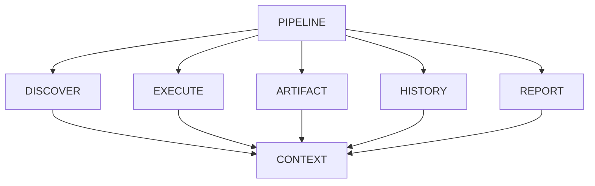

# v4.9 — Workflow Context

> 從 Pipeline 到 Workflow Context
> 讓 Stage 之間解耦，而不是彼此依賴

---

# 🎯 這一版的目標

v4.8 已經完成了 Workflow Pipeline。

```text
Runner

↓

Pipeline

↓

Stage1

↓

Stage2

↓

Stage3
```

流程終於被拆開了。

但是新的問題又出現了。

---

# 🤔 我開始思考一個問題

Discovery Stage 找到：

```python
tests = discover_tests()
```

那 Execute Stage 要怎麼取得？

---

Artifact Stage 又需要：

```python
execution_result
```

---

Report Stage 又需要：

```python
artifact
```

---

History Stage 又需要：

```python
execution_result
```

---

最後變成：

```python
stage.run(
    tests,
    execution_result,
    artifact,
    history,
    report,
    ...
)
```

參數越來越長。

開始覺得：

> 這是不是哪裡怪怪的？

---

# 💬 我當時和 ChatGPT 的討論

我問：

> Stage 之間是不是一定要互相知道彼此？

ChatGPT 回答：

很多成熟的 Workflow System 都不是這樣。

例如：

* Airflow
* GitHub Actions
* Jenkins Pipeline

它們通常都有：

```text
Workflow Context
```

大家共享 Context。

而不是互相傳參數。

---

# 🧠 我開始理解

以前：

```text
Stage A

↓

把資料丟給

↓

Stage B
```

變成：

```text
Stage A

↓

Workflow Context

↑

Stage B
```

大家都只跟 Context 溝通。

---

# 🏗️ 新架構



---

# 💻 WorkflowContext

```python
from dataclasses import dataclass, field

@dataclass
class WorkflowContext:

    tests: list = field(default_factory=list)

    execution_result = None

    artifacts: list = field(default_factory=list)

    report = None
```

---

# 💻 Pipeline

```python
class WorkflowPipeline:

    def __init__(self, stages):

        self.stages = stages

    def run(self):

        context = WorkflowContext()

        for stage in self.stages:

            context = stage.run(context)

        return context
```

---

# 💻 Discover Stage

```python
class DiscoverStage:

    def run(self, context):

        context.tests = discover()

        return context
```

---

# 💻 Execute Stage

```python
class ExecuteStage:

    def run(self, context):

        result = execute(
            context.tests
        )

        context.execution_result = result

        return context
```

---

# 💻 Report Stage

```python
class ReportStage:

    def run(self, context):

        context.report = build_report(
            context.execution_result
        )

        return context
```

---

# 😅 我踩過的坑

一開始我還是一直想：

```python
stage.run(
    tests,
    result,
    artifact,
    report
)
```

覺得很直覺。

但後來發現：

每新增一個 Stage，

所有 function signature 都要改。

甚至：

Stage 根本不知道自己需要哪些東西。

---

另一個坑是：

我曾經想讓：

```python
context = {}
```

用 dictionary。

例如：

```python
context["tests"]

context["artifact"]

context["history"]
```

但越寫越亂。

沒有型別。

IDE 幾乎不能補全。

最後還是決定：

```python
WorkflowContext
```

統一管理。

---

# 💡 我最大的心得

v3 的時候，

我理解了：

```text
Execution

↓

Backend
```

---

v4.8 的時候，

我理解了：

```text
Workflow

↓

Pipeline
```

---

到了 v4.9，

我開始理解：

```text
Workflow

↓

State
```

---

真正需要管理的，

不是 Stage。

而是：

> Workflow State

---

# 🧩 我後來怎麼理解

以前我覺得：

Runner 在跑程式。

現在開始覺得：

Runner 在搬運狀態。

Stage 只是：

對 State 做 Transformation。

有點像：

```text
State0

↓

Stage1

↓

State1

↓

Stage2

↓

State2

↓

Stage3

↓

State3
```

---

# 🚀 如果重來一次

如果重新設計，

我可能在 v4.8 就一起設計：

* Pipeline
* WorkflowContext

而不是拆成兩版。

但也因為拆開，

我更能理解：

Pipeline 和 Context 是兩個不同層次的問題。

---

# 🔮 為什麼會有 v5.0

做到這裡，

我突然想到：

WorkflowContext 只有一份。

如果：

```text
100 個 Test

↓

同時執行
```

呢？

如果：

```text
Docker Backend

+

CI Backend
```

一起跑呢？

WorkflowContext 還能共享嗎？

還是每個 Worker 都要自己的 Context？

於是開始思考：

* Parallel Execution
* Worker Model
* Scheduler
* Distributed Runner

LeetCode Runner 也正式開始從：

> Framework Design

走向：

> Scalability Design。
